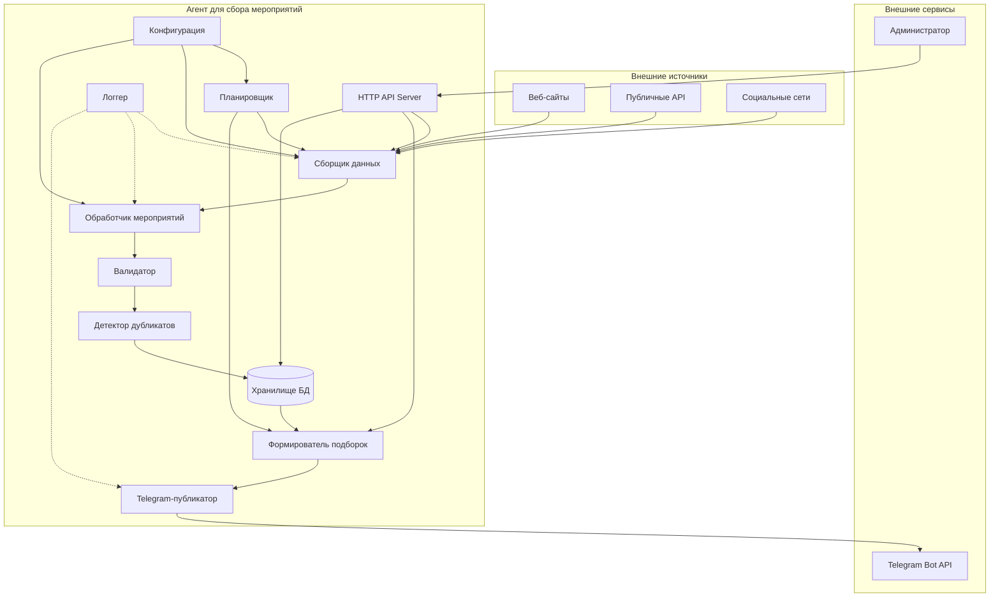
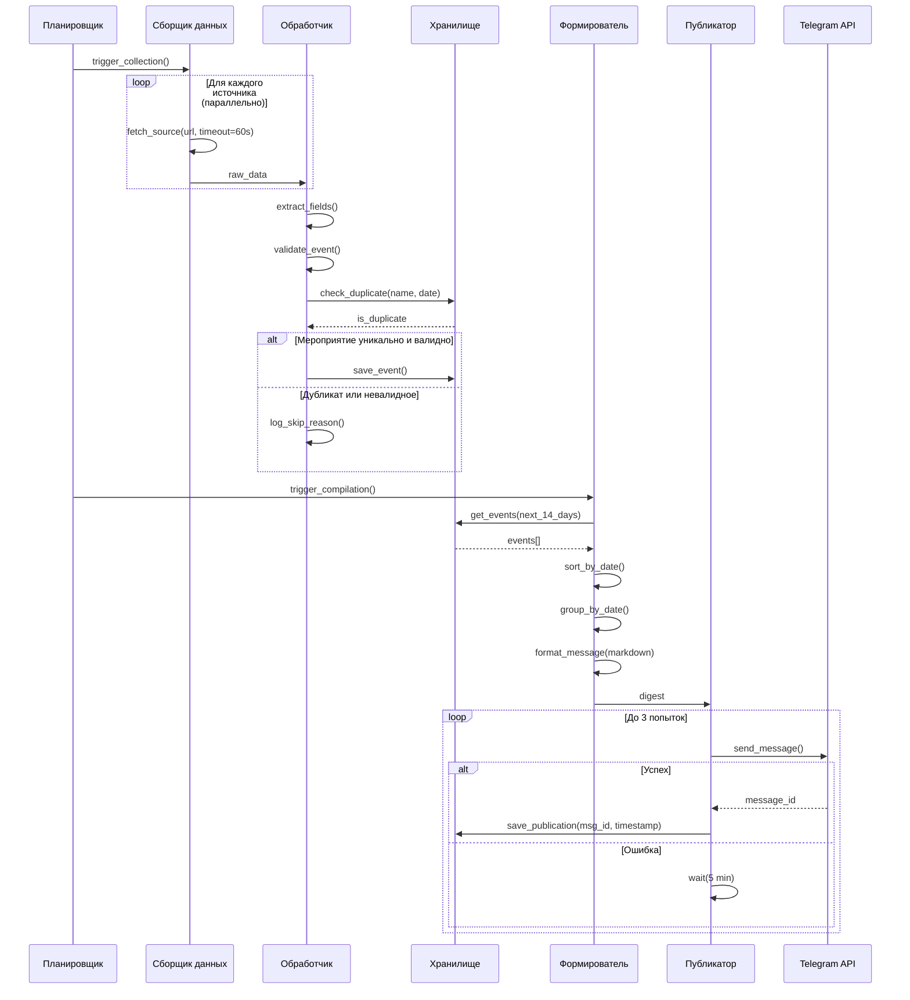

# Документ Технического Дизайна

## Обзор

Данный документ описывает техническую архитектуру А-агента для автоматизированного сбора, структурирования и публикации информации о мероприятиях на Бали в Telegram-канале. Система представляет собой автономное приложение, которое периодически собирает данные из множественных источников, обрабатывает и валидирует их, формирует структурированные подборки и публикует в Telegram.

### Реализуемость

**Да, программа полностью реализуема** и может выполнять все требования из requirements.md. Все требования основываются на проверенных технологиях и паттернах:

- **Сбор данных**: Используем стандартные библиотеки для веб-скрапинга (BeautifulSoup, Scrapy) и работы с API
- **Хранение данных**: SQLite для локального хранения или PostgreSQL для продакшена
- **Планирование задач**: APScheduler или Celery для управления расписанием
- **Telegram интеграция**: Официальная библиотека python-telegram-bot
- **Обработка ошибок**: Стандартные механизмы retry с экспоненциальной задержкой

### Как это будет работать

1. **Планировщик** запускает процесс сбора по расписанию (например, каждый день в 09:00)
2. **Сборщик данных** параллельно опрашивает все настроенные источники
3. **Обработчик мероприятий** извлекает структурированную информацию, валидирует и проверяет на дубликаты
4. **Хранилище** сохраняет валидные уникальные мероприятия
5. **Формирователь подборок** извлекает мероприятия на ближайшие 14 дней, группирует по датам
6. **Telegram-публикатор** форматирует и отправляет подборку в канал
7. **API-сервер** позволяет администратору управлять системой вручную

## Архитектура

### Общая архитектура системы

Система построена по модульной архитектуре с разделением ответственности:



### Технологический стек

| Компонент | Технология | Обоснование |
|---|---|---|
| **Язык программирования** | Python 3.11+ | Богатая экосистема для парсинга и ботов |
| **Планировщик задач** | APScheduler 3.x | Гибкое расписание, без внешних зависимостей |
| **Веб-парсинг (HTML)** | BeautifulSoup4 + httpx | Современный async HTTP-клиент + удобный парсер |
| **Браузерный парсинг** | Playwright | Для JS-рендеренных страниц |
| **Instagram/Facebook** | instaloader / facebook-scraper | Публичные посты без официального API |
| **База данных** | SQLite (sqlite-utils) | Легковесное встроенное решение, без сервера |
| **ORM** | SQLAlchemy 2.0 | Абстракция над БД, удобные запросы |
| **Telegram Bot** | python-telegram-bot 21.x | Официальная поддержка, async |
| **HTTP API** | FastAPI + uvicorn | Быстрый async веб-сервер, авто-документация |
| **Конфигурация** | YAML + Pydantic | Читаемый формат, строгая валидация схемы |
| **Логирование** | structlog + logging | Структурированные логи с ротацией |
| **Retry-логика** | tenacity | Декларативные повторные попытки |
| **Тестирование** | pytest + hypothesis | PBT для свойств конфигурации |
| **Управление зависимостями** | uv / Poetry | Воспроизводимые окружения |

### Схема потока данных



## Компоненты и интерфейсы

### 1. Планировщик (Scheduler)

Отвечает за своевременный запуск сбора данных и публикации подборок.

```python
class Scheduler:
    def setup(self, config: SchedulerConfig) -> None:
        """Инициализирует задачи по расписанию из конфигурации"""
    
    def start(self) -> None:
        """Запускает планировщик"""
    
    def trigger_collection_now(self) -> None:
        """Немедленный запуск сбора (для HTTP API)"""
    
    def trigger_publication_now(self) -> None:
        """Немедленный запуск публикации (для HTTP API)"""
```

**Реализация**: APScheduler с CronTrigger для настройки расписания вплоть до часа.

### 2. Сборщик данных (DataCollector)

Извлекает данные из разных типов источников.

```python
class BaseCollector(ABC):
    timeout: int = 60  # секунд — требование 1.6
    max_retries: int = 3  # требование 12.4
    
    @abstractmethod
    async def fetch(self, source: SourceConfig) -> list[RawEvent]:
        """Возвращает список сырых событий из источника"""

class WebHtmlCollector(BaseCollector):
    """Парсинг HTML через BeautifulSoup + httpx"""

class ApiCollector(BaseCollector):
    """Запросы к публичным REST API"""

class SocialMediaCollector(BaseCollector):
    """Извлечение из Instagram/Facebook публичных страниц"""
```

**Обработка ошибок сети** (требование 12):
- Timeout 30 сек → запись в лог, переход к следующему источнику
- HTTP 5xx → повтор через 60 сек, макс 3 попытки
- HTTP 4xx → лог, пропуск источника без повторов

### 3. Обработчик мероприятий (EventProcessor)

Структурирует сырые данные и применяет бизнес-правила.

```python
class EventProcessor:
    def process(self, raw: RawEvent) -> ProcessResult:
        """Оркестрирует: extract → validate → dedup → save"""
    
    def extract_fields(self, raw: RawEvent) -> Event:
        """Извлекает все поля: название, дату, место, описание,
        ссылку, цену (опционально), категорию (опционально)"""
    
    def validate(self, event: Event) -> ValidationResult:
        """Проверяет: название 3-200 символов, дата в будущем, 
        место указано"""
    
    def is_duplicate(self, event: Event) -> bool:
        """Проверяет по (название, дата) в БД"""
```

### 4. Формирователь подборок (DigestCompiler)

Собирает и форматирует публикуемую подборку.

```python
class DigestCompiler:
    MAX_EVENTS = 30  # требование 5.6
    WINDOW_DAYS = 14  # требование 5.1
    
    def compile(self) -> Digest:
        """Собирает мероприятия на 14 дней, сортирует, группирует,
        форматирует с Markdown"""
    
    def format_event(self, event: Event) -> str:
        """Формирует строку события: **Название** + *Дата* + 
        место + ссылка + цена"""
    
    def format_digest(self, grouped: dict[date, list[Event]]) -> str:
        """Собирает финальное сообщение с заголовком периода"""
```

### 5. Telegram-публикатор (TelegramPublisher)

Публикует подборки в канал с обработкой ошибок.

```python
class TelegramPublisher:
    MAX_RETRIES = 3  # требование 6.4
    RETRY_DELAY = 300  # 5 минут (требование 6.3)
    TELEGRAM_UNAVAILABLE_DELAY = 600  # 10 минут (требование 12.5)
    
    async def publish(self, digest: Digest) -> PublishResult:
        """Отправляет в канал с retry-логикой"""
    
    async def notify_admin(self, error: str) -> None:
        """Уведомление администратору при полном провале (требование 6.5)"""
```

**Форматирование Markdown** (требование 7):
- `**Название события**` — жирный шрифт
- `_DD.MM.YYYY HH:MM_` — курсив для дат
- Эмодзи по категории: 🎵 музыка, 🏃 спорт, 🎨 искусство, 📚 образование, 🎉 другое
- `[Ссылка](url)` — кликабельные гиперссылки
- Заголовок: `📅 *Мероприятия Бали: 01–14 января 2025*`

### 6. HTTP API Server

FastAPI приложение для ручного управления (требование 15).

```python
# Endpoints:
POST /api/collect        # запустить сбор данных
POST /api/publish        # запустить публикацию
GET  /api/stats          # статистика (событий в БД, дата последней публикации)

# Аутентификация: Bearer token в заголовке Authorization
# 401 при отсутствии/невалидном токене (требование 15.4, 15.5)
```

### 7. Парсер конфигурации (ConfigParser)

```python
class ConfigParser:
    def parse(self, yaml_content: str) -> Configuration:
        """Читает YAML, валидирует схему через Pydantic"""
    
    def format(self, config: Configuration) -> str:
        """Сериализует Configuration обратно в YAML (round-trip)"""
```

**Свойство round-trip** (требование 10.4):
`parse(format(parse(yaml))) == parse(yaml)` — для любого валидного YAML конфигурации.


### Рефлексия свойств

После анализа всех критериев приемки, выявлены следующие возможности для объединения и оптимизации:

**Группа 1: Валидация событий (3.1, 3.2, 3.3, 3.5)**
- Свойства 3.1, 3.2, 3.3 проверяют отдельные аспекты валидации (длина названия, дата, место)
- Свойство 3.5 проверяет результат валидации (сохранение валидных событий)
- **Решение**: Объединить в одно комплексное свойство "Валидация событий", которое проверяет все правила валидации и результирующее поведение

**Группа 2: Дедупликация (4.1, 4.2, 4.3)**
- Все три свойства описывают различные аспекты одного процесса дедупликации
- 4.1 проверяет обнаружение дубликатов, 4.2 - пропуск дубликатов, 4.3 - сохранение уникальных
- **Решение**: Объединить в одно свойство "Дедупликация событий по названию и дате"

**Группа 3: Формирование подборок (5.1, 5.2, 5.3)**
- Свойства описывают различные аспекты обработки списка событий (фильтрация, сортировка, группировка)
- Все они применяются к одному и тому же процессу формирования подборки
- **Решение**: Сохранить как отдельные свойства, т.к. они проверяют независимые инварианты

**Группа 4: Форматирование (5.4, 5.5, 7.1-7.6)**
- Свойства 5.4 и 5.5 про форматирование событий, 7.1-7.6 про Markdown форматирование
- Все проверяют разные аспекты форматирования текста
- **Решение**: Объединить в одно свойство "Форматирование сообщений Telegram"

**Группа 5: Конфигурация (10.1, 10.3, 10.4)**
- Свойства 10.1 и 10.3 по отдельности проверяют парсинг и форматирование
- Свойство 10.4 - это round-trip, который включает оба предыдущих
- **Решение**: Свойство 10.4 (round-trip) включает 10.1 и 10.3, оставляем только его

**Итоговые свойства после рефлексии:**
1. Извлечение полей из сырых данных (2.1-2.7)
2. Валидация событий (3.1-3.3, 3.5) - объединено
3. Дедупликация событий (4.1-4.3) - объединено
4. Фильтрация событий по периоду (5.1)
5. Сортировка событий по дате (5.2)
6. Группировка событий по датам (5.3)
7. Ограничение размера подборки (5.6)
8. Форматирование сообщений (5.4, 5.5, 7.1-7.6) - объединено
9. Конфигурация round-trip (10.4)
10. Сохранение истории публикаций (13.1-13.5)
11. Фильтрация по категориям (14.2, 14.3)

### Свойство 1: Извлечение полей из сырых данных

*Для любого* объекта RawEvent, содержащего полную информацию о событии, обработчик событий ДОЛЖЕН извлечь все обязательные поля (название, дата, время, место, описание, ссылка) и опциональные поля (цена, категория) в структурированный объект Event.

**Validates: Requirements 2.1, 2.2, 2.3, 2.4, 2.5, 2.6, 2.7**

### Свойство 2: Валидация событий

*Для любого* объекта Event:
- ЕСЛИ длина названия находится в диапазоне [3, 200] символов И дата проведения в будущем И указано место проведения, ТО событие является валидным и ДОЛЖНО быть сохранено в хранилище
- ИНАЧЕ событие является невалидным и НЕ ДОЛЖНО быть сохранено

**Validates: Requirements 3.1, 3.2, 3.3, 3.5**

### Свойство 3: Дедупликация событий

*Для любых* двух объектов Event:
- ЕСЛИ у них совпадают название И дата проведения, ТО они считаются дубликатами
- ЕСЛИ события являются дубликатами, ТО в хранилище ДОЛЖНА быть сохранена только одна копия
- ЕСЛИ события уникальны (различаются по названию ИЛИ дате), ТО обе копии ДОЛЖНЫ быть сохранены

**Validates: Requirements 4.1, 4.2, 4.3**

### Свойство 4: Фильтрация событий по периоду

*Для любого* набора событий в хранилище, при формировании подборки ДОЛЖНЫ быть включены только события, дата которых находится в диапазоне [текущая_дата, текущая_дата + 14 дней].

**Validates: Requirements 5.1**

### Свойство 5: Сортировка событий по дате

*Для любого* набора событий, включенных в подборку, результирующий список ДОЛЖЕН быть отсортирован по возрастанию даты проведения (от ближайших к дальним).

**Validates: Requirements 5.2**

### Свойство 6: Группировка событий по датам

*Для любого* набора событий в подборке, события с одинаковой датой проведения ДОЛЖНЫ быть сгруппированы вместе в результирующей структуре.

**Validates: Requirements 5.3**

### Свойство 7: Ограничение размера подборки

*Для любого* набора событий размером N (где N может быть любым положительным целым числом), сформированная подборка ДОЛЖНА содержать не более 30 событий (min(N, 30)).

**Validates: Requirements 5.6**

### Свойство 8: Форматирование сообщений Telegram

*Для любого* объекта Compilation, форматированное сообщение для Telegram ДОЛЖНО:
- Содержать все обязательные поля каждого события (название, дата, время, место, ссылка)
- Включать цену, если она доступна
- Использовать Markdown разметку (жирный для названий, курсив для дат)
- Использовать эмодзи для категорий
- Оформлять ссылки как кликабельные гиперссылки
- Содержать заголовок с указанием периода

**Validates: Requirements 5.4, 5.5, 7.1, 7.2, 7.3, 7.4, 7.5, 7.6**

### Свойство 9: Конфигурация round-trip

*Для любого* валидного объекта Configuration, операция (parse -> format -> parse) ДОЛЖНА создать эквивалентный объект Configuration (все поля сохраняют свои значения).

**Validates: Requirements 10.4**

### Свойство 10: Сохранение истории публикаций

*Для любой* успешной публикации подборки в Telegram, в хранилище ДОЛЖНА быть создана запись Publication, содержащая timestamp публикации, список ID событий из подборки и ID сообщения в Telegram.

**Validates: Requirements 13.1, 13.2, 13.3, 13.4**

### Свойство 11: Фильтрация по категориям

*Для любого* события с категорией и заданного списка разрешенных категорий:
- ЕСЛИ список разрешенных категорий не пуст И категория события НЕ входит в список, ТО событие ДОЛЖНО быть отфильтровано
- ЕСЛИ список разрешенных категорий пуст, ТО событие ДОЛЖНО быть включено независимо от категории

**Validates: Requirements 14.2, 14.3**

## Обработка ошибок

### Стратегия обработки ошибок

Система должна быть отказоустойчивой и продолжать работу даже при сбоях отдельных компонентов.

### Сетевые ошибки

**Timeout источников** (Requirements 12.1):
- Таймаут для каждого источника: 30 секунд
- При timeout: прервать запрос, записать в лог, продолжить со следующим источником
- Не блокировать работу других источников

**HTTP ошибки** (Requirements 12.2, 12.3, 12.4):
- 5xx ошибки: повторить запрос через 60 секунд, максимум 3 попытки
- 4xx ошибки: записать в лог, пропустить источник (не повторять)
- После 3 неудачных попыток: пропустить источник до следующего цикла сбора

**Telegram API недоступен** (Requirements 12.5, 6.3, 6.4, 6.5):
- При ошибке публикации: повторить через 5 минут
- Максимум 3 попытки публикации
- После 3 неудач: отправить уведомление администратору, отложить публикацию до следующего цикла

### Ошибки данных

**Невалидные события** (Requirements 3.4):
- Записать причину отклонения в лог (недостаточная длина названия, дата в прошлом, отсутствие места)
- Не прерывать обработку других событий
- Продолжить с следующим событием

**Ошибки конфигурации** (Requirements 9.6):
- При загрузке: валидировать структуру конфигурации
- При ошибках: записать детальное сообщение в лог с указанием проблемы
- Прекратить запуск системы (fail-fast для критичных ошибок конфигурации)

### Логирование ошибок

Все ошибки должны логироваться с уровнем ERROR и включать:
- Timestamp
- Описание ошибки
- Stack trace (для исключений)
- Контекст (какой источник, какое событие и т.д.)

## Стратегия тестирования

### Подход к тестированию

Система использует **двойной подход к тестированию**:
1. **Unit тесты** - для конкретных примеров, граничных случаев и обработки ошибок
2. **Property-based тесты** - для универсальных свойств корректности (где применимо)

### Property-Based Testing

**Применимость PBT**: Данная система содержит значительную бизнес-логику (парсинг, валидация, трансформация данных), которая хорошо подходит для property-based testing.

**Библиотека**: [Hypothesis](https://hypothesis.readthedocs.io/) - ведущая библиотека для PBT в Python

**Конфигурация**:
- Минимум **100 итераций** на каждый property тест
- Каждый property тест помечается комментарием с ссылкой на свойство из дизайна

**Пример тега**:
```python
# Feature: bali-events-aggregator, Property 2: Валидация событий
@given(events=st_events())
def test_event_validation_property(events):
    # тест implementation
```

### Покрытие тестами по свойствам

**Property-based тесты** (11 свойств):
1. ✅ Извлечение полей из сырых данных
2. ✅ Валидация событий
3. ✅ Дедупликация событий
4. ✅ Фильтрация событий по периоду
5. ✅ Сортировка событий по дате
6. ✅ Группировка событий по датам
7. ✅ Ограничение размера подборки
8. ✅ Форматирование сообщений Telegram
9. ✅ Конфигурация round-trip
10. ✅ Сохранение истории публикаций
11. ✅ Фильтрация по категориям

**Unit тесты** (специфические сценарии):
- Обработка недоступных источников
- Retry логика для публикаций
- Обработка ошибок сети (timeout, 5xx, 4xx)
- Логирование событий
- Авторизация API
- Интеграция с планировщиком

**Integration тесты**:
- Взаимодействие компонентов (Collector -> Processor -> Storage)
- Telegram API (с mock)
- Работа планировщика
- HTTP API endpoints

### Генераторы данных для Hypothesis

Для property-based тестов необходимо определить следующие генераторы:

```python
from hypothesis import strategies as st
from hypothesis.strategies import composite

@composite
def st_raw_events(draw):
    """Генератор сырых событий"""
    return RawEvent(
        source_type=draw(st.sampled_from(['web', 'api', 'social'])),
        source_url=draw(st.text(min_size=10)),
        raw_data=draw(st.dictionaries(
            keys=st.sampled_from(['name', 'date', 'location', 'description', 'price', 'category']),
            values=st.text()
        )),
        collected_at=draw(st.datetimes())
    )

@composite
def st_events(draw, valid=None):
    """Генератор событий (валидных или невалидных)"""
    name_length = draw(st.integers(min_value=0, max_value=300))
    date_in_future = draw(st.booleans()) if valid is None else valid
    has_location = draw(st.booleans()) if valid is None else valid
    
    return Event(
        id=None,
        name=draw(st.text(min_size=name_length, max_size=name_length)),
        date=draw(st.datetimes(
            min_value=datetime.now() if date_in_future else datetime(2000, 1, 1),
            max_value=datetime.now() + timedelta(days=365) if date_in_future else datetime.now()
        )),
        time=draw(st.one_of(st.none(), st.text(min_size=5, max_size=5))),
        location=draw(st.text(min_size=1)) if has_location else None,
        description=draw(st.one_of(st.none(), st.text())),
        price=draw(st.one_of(st.none(), st.text())),
        category=draw(st.one_of(st.none(), st.sampled_from(['music', 'sport', 'art', 'education']))),
        source_url=draw(st.text(min_size=10)),
        created_at=datetime.now()
    )

@composite
def st_configurations(draw):
    """Генератор конфигураций"""
    return Configuration(
        sources=draw(st.lists(st.builds(SourceConfig), min_size=1)),
        scheduler=draw(st.builds(SchedulerConfig)),
        telegram=draw(st.builds(TelegramConfig)),
        filters=draw(st.builds(FilterConfig)),
        api_token=draw(st.text(min_size=32, max_size=64))
    )
```

### Тестовое окружение

**Unit и Property тесты**:
- Используют in-memory SQLite для быстроты
- Mock внешних сервисов (Telegram API, веб-источники)
- Изолированы друг от друга

**Integration тесты**:
- Используют тестовую базу данных
- Mock только внешних API (Telegram, социальные сети)
- Тестируют реальные взаимодействия компонентов

### CI/CD

Тесты запускаются автоматически при каждом коммите:
1. Lint (flake8, mypy)
2. Unit тесты (быстрые, < 1 минуты)
3. Property тесты (100+ итераций, 2-5 минут)
4. Integration тесты (с mock сервисами, 1-2 минуты)

## Развертывание

### Варианты развертывания

**Вариант 1: Docker контейнер**
- Минимальные системные требования
- Легко обновлять и масштабировать
- Подходит для облачных платформ (AWS ECS, Google Cloud Run)

**Вариант 2: Systemd сервис**
- Для развертывания на собственном сервере
- Автоматический перезапуск при сбоях
- Простая интеграция с системным логированием

### Конфигурация production

```yaml
# config/settings.yaml
telegram:
  bot_token: "${TELEGRAM_BOT_TOKEN}"
  channel_id: "${TELEGRAM_CHANNEL_ID}"

scheduler:
  collection_frequency: "daily"
  collection_time: "08:00"
  publication_frequency: "daily"
  publication_time: "18:00"

filters:
  allowed_categories:
    - "music"
    - "art"
    - "education"
    - "sport"

api:
  token: "${API_TOKEN}"
  host: "0.0.0.0"
  port: 8000

database:
  url: "${DATABASE_URL}"  # PostgreSQL для production

logging:
  level: "INFO"
  max_file_size_mb: 10
  max_files: 10
```

### Переменные окружения

Чувствительные данные передаются через переменные окружения:
- `TELEGRAM_BOT_TOKEN` - токен Telegram бота
- `TELEGRAM_CHANNEL_ID` - ID целевого канала
- `API_TOKEN` - токен для HTTP API
- `DATABASE_URL` - строка подключения к БД
- `INSTAGRAM_USERNAME`, `INSTAGRAM_PASSWORD` - credentials для Instagram (если используется)
- `FACEBOOK_ACCESS_TOKEN` - токен для Facebook API (если используется)

### Мониторинг

**Метрики для отслеживания**:
- Количество собранных событий за цикл
- Количество источников с ошибками
- Время выполнения сбора данных
- Успешность публикаций в Telegram
- Количество событий в базе
- Использование дискового пространства (логи, база)

**Алерты**:
- Все источники недоступны > 1 часа
- Публикация не удалась 3 раза подряд
- База данных недоступна
- Диск заполнен > 90%

## Безопасность

### Защита credentials

- Все токены и пароли хранятся в переменных окружения
- Конфигурационные файлы не содержат секретов
- Логи не содержат чувствительных данных (токены маскируются)

### API авторизация

- Все endpoints требуют авторизационный токен в заголовке `Authorization: Bearer <token>`
- Неправильный/отсутствующий токен возвращает HTTP 401
- Токен должен быть сложным (минимум 32 символа)

### Ограничение rate limit

- API endpoints имеют rate limiting (например, 100 запросов в час)
- Защита от злоупотреблений ручными запусками

## Будущие улучшения

### Возможные расширения

1. **ML для фильтрации качества событий**
   - Обучить модель на исторических данных
   - Автоматически фильтровать низкокачественные события

2. **Рекомендательная система**
   - Анализ популярности событий (просмотры, клики)
   - Персонализированные рекомендации для подписчиков

3. **Мультиканальность**
   - Публикация не только в Telegram, но и в Twitter, Instagram
   - Адаптация форматирования под каждую платформу

4. **Веб-интерфейс администратора**
   - Визуальное управление источниками
   - Просмотр статистики и логов
   - Ручная модерация событий

5. **A/B тестирование форматов**
   - Экспериментирование с различными форматами подборок
   - Оптимизация engagement

## Заключение

Данный дизайн представляет собой надежную, расширяемую и отказоустойчивую систему для автоматизации сбора и публикации информации о мероприятиях на Бали. Модульная архитектура позволяет легко добавлять новые источники данных и адаптировать систему под изменяющиеся требования.

Комбинация unit-тестов и property-based тестов обеспечивает высокий уровень уверенности в корректности системы, а подробное логирование упрощает диагностику проблем в production.

## Модели данных

### Схема базы данных

```sql
-- Мероприятия
CREATE TABLE events (
    id          INTEGER PRIMARY KEY AUTOINCREMENT,
    title       TEXT NOT NULL,           -- 3-200 символов
    event_date  DATE NOT NULL,           -- всегда в будущем при добавлении
    event_time  TIME,                    -- может быть NULL
    location    TEXT NOT NULL,
    description TEXT,
    source_url  TEXT NOT NULL,
    price       TEXT,                    -- строка (например "200k IDR" или "Free")
    category    TEXT,                    -- NULL если неизвестна
    source_id   INTEGER NOT NULL REFERENCES sources(id),
    created_at  DATETIME DEFAULT CURRENT_TIMESTAMP,
    UNIQUE(title, event_date)            -- ключ дедупликации (требование 4.1)
);

-- Источники данных
CREATE TABLE sources (
    id          INTEGER PRIMARY KEY AUTOINCREMENT,
    name        TEXT NOT NULL,
    type        TEXT NOT NULL,           -- 'website' | 'api' | 'social'
    url         TEXT NOT NULL,
    is_active   BOOLEAN DEFAULT TRUE
);

-- История публикаций
CREATE TABLE publications (
    id              INTEGER PRIMARY KEY AUTOINCREMENT,
    published_at    DATETIME NOT NULL,   -- timestamp (требование 13.2)
    telegram_msg_id TEXT NOT NULL,       -- ID сообщения (требование 13.4)
    period_from     DATE NOT NULL,
    period_to       DATE NOT NULL,
    created_at      DATETIME DEFAULT CURRENT_TIMESTAMP
);

-- Мероприятия в публикации (M2M)
CREATE TABLE publication_events (
    publication_id  INTEGER REFERENCES publications(id),
    event_id        INTEGER REFERENCES events(id),
    PRIMARY KEY (publication_id, event_id)   -- список ID (требование 13.3)
);
```

### Python модели данных (Pydantic)

```python
from datetime import date, time, datetime
from typing import Optional
from pydantic import BaseModel, Field, field_validator

class Event(BaseModel):
    title: str = Field(min_length=3, max_length=200)  # требование 3.1
    event_date: date                                    # требование 3.2
    event_time: Optional[time] = None
    location: str = Field(min_length=1)                # требование 3.3
    description: Optional[str] = None
    source_url: str
    price: Optional[str] = None                        # требование 2.6
    category: Optional[str] = None                     # требование 2.7

    @field_validator('event_date')
    def date_must_be_future(cls, v):
        if v < date.today():
            raise ValueError("Дата должна быть в будущем")
        return v

class RawEvent(BaseModel):
    """Неструктурированные данные до обработки"""
    raw_title: Optional[str] = None
    raw_date: Optional[str] = None
    raw_location: Optional[str] = None
    raw_description: Optional[str] = None
    raw_price: Optional[str] = None
    raw_category: Optional[str] = None
    source_url: str

class Digest(BaseModel):
    period_from: date
    period_to: date
    events_by_date: dict[date, list[Event]]
    formatted_text: str                    # Готовый Markdown для Telegram
```

### Конфигурационный файл (YAML)

```yaml
# config.yaml — пример структуры

telegram:
  bot_token: "BOT_TOKEN_HERE"
  channel_id: "@bali_events"
  admin_user_id: 123456789           # для уведомлений (требование 6.5)

api:
  token: "SECRET_API_TOKEN"          # для HTTP API (требование 15.4)
  port: 8080

scheduler:
  collection:
    schedule: "0 9 * * *"            # Cron: каждый день в 09:00 (требование 8.1, 8.2)
  publication:
    schedule: "0 10 * * 1,4"         # Пн и Чт в 10:00 (требование 8.3)

filters:
  allowed_categories:                # пустой список = все категории (требование 14.4)
    - music
    - sport
    - art
    - education

sources:
  - name: "Bali Events Guide"
    type: website                    # требование 9.2
    url: "https://balievents.com"    # требование 9.3
    enabled: true
    parsing_rules:                   # требование 9.4
      event_selector: ".event-card"
      title_selector: "h2.event-title"
      date_selector: ".event-date"
      location_selector: ".event-venue"
      description_selector: ".event-desc"
      price_selector: ".event-price"
      link_selector: "a.event-link"
  
  - name: "Bali Events API"
    type: api
    url: "https://api.balievents.com/v1/events"
    enabled: true
    auth:                            # требование 9.5
      type: bearer
      token: "API_KEY_HERE"
  
  - name: "Bali Events Instagram"
    type: social
    url: "balievents_official"
    enabled: true
```

### Структура Pydantic для конфигурации

```python
class ParsingRules(BaseModel):
    event_selector: str
    title_selector: str
    date_selector: str
    location_selector: str
    description_selector: str
    price_selector: Optional[str] = None
    link_selector: str

class SourceAuth(BaseModel):
    type: str  # 'bearer' | 'basic' | 'api_key'
    token: Optional[str] = None
    username: Optional[str] = None
    password: Optional[str] = None

class SourceConfig(BaseModel):
    name: str
    type: str  # 'website' | 'api' | 'social'
    url: str
    enabled: bool = True
    parsing_rules: Optional[ParsingRules] = None
    auth: Optional[SourceAuth] = None

class ScheduleConfig(BaseModel):
    collection: dict  # {'schedule': '0 9 * * *'}
    publication: dict

class Configuration(BaseModel):
    telegram: dict
    api: dict
    scheduler: ScheduleConfig
    filters: dict
    sources: list[SourceConfig]
```

## Correctness Properties

*Свойство (property) — это характеристика или поведение, которое должно выполняться для всех валидных входных данных системы. По сути, это формальное утверждение о том, что должна делать система. Свойства служат мостом между человекочитаемыми спецификациями и машинно-проверяемыми гарантиями корректности.*

Данная система хорошо подходит для property-based testing, так как содержит множество чистых функций с четким поведением ввода-вывода: парсинг, валидация, трансформация данных, форматирование. Свойства ниже будут проверяться через генерацию случайных тестовых данных (минимум 100 итераций на свойство).

### Property 1: Извлечение всех полей из сырых данных

*Для любого* объекта RawEvent, функция extract_fields() должна корректно извлечь все присутствующие поля (title, date, time, location, description, source_url, price, category) в соответствующие поля объекта Event, а отсутствующие опциональные поля должны быть None.

**Validates: Requirements 2.1, 2.2, 2.3, 2.4, 2.5, 2.6, 2.7**

### Property 2: Валидация мероприятий

*Для любого* объекта Event, функция validate() должна:
- Отклонить событие, если title содержит менее 3 или более 200 символов
- Отклонить событие, если event_date находится в прошлом
- Отклонить событие, если location пустое или отсутствует
- Принять событие, только если все три условия выполнены

**Validates: Requirements 3.1, 3.2, 3.3**

### Property 3: Детектирование дубликатов

*Для любых* двух объектов Event, функция is_duplicate() должна вернуть True тогда и только тогда, когда у них совпадают поля title и event_date (без учета регистра для title).

**Validates: Requirements 4.1**

### Property 4: Фильтрация по 14-дневному окну

*Для любого* списка мероприятий, функция compile() должна включить в подборку только те события, чья дата проведения находится в диапазоне от сегодня до сегодня + 14 дней (включительно).

**Validates: Requirements 5.1**

### Property 5: Сортировка по дате

*Для любого* списка мероприятий в подборке, результирующий список должен быть отсортирован по возрастанию event_date. Для всех индексов i, j где i < j, должно выполняться events[i].event_date ≤ events[j].event_date.

**Validates: Requirements 5.2**

### Property 6: Группировка по датам

*Для любого* списка мероприятий, функция group_by_date() должна создать словарь, где ключи — уникальные даты, а значения — списки всех мероприятий с этой датой. Сумма длин всех списков должна равняться длине исходного списка (все мероприятия сохранены).

**Validates: Requirements 5.3**

### Property 7: Полнота форматирования события

*Для любого* объекта Event, функция format_event() должна вернуть строку, которая содержит:
- Название в жирном шрифте (обрамлено `**`)
- Дату в курсиве (обрамлено `_`)
- Место проведения (plain text)
- Ссылку в формате Markdown гиперссылки `[текст](url)`
- Цену (если price не None)
- Эмодзи категории (если category указана)

**Validates: Requirements 5.4, 5.5, 7.1, 7.2, 7.3, 7.4, 7.5**

### Property 8: Ограничение размера подборки

*Для любого* списка мероприятий, функция compile() должна вернуть подборку, содержащую не более 30 мероприятий. Если входной список содержит более 30 событий (после фильтрации по датам), должны быть выбраны первые 30 после сортировки по дате.

**Validates: Requirements 5.6**

### Property 9: Round-trip для конфигурации

*Для любого* валидного объекта Configuration, применение последовательности операций parse(format(config)) должно вернуть объект, эквивалентный исходному config. То есть: `ConfigParser.parse(ConfigFormatter.format(config)) == config`.

Это свойство гарантирует, что сериализация и десериализация конфигурации обратимы без потери данных.

**Validates: Requirements 10.4**

### Property 10: Парсинг валидных конфигураций

*Для любого* синтаксически корректного YAML файла конфигурации, соответствующего схеме Configuration, функция ConfigParser.parse() должна успешно вернуть объект Configuration без выброса исключения.

**Validates: Requirements 10.1**

### Property 11: Обработка невалидных конфигураций

*Для любого* YAML файла, который не соответствует схеме Configuration (отсутствуют обязательные поля, неверные типы данных, некорректный синтаксис), функция ConfigParser.parse() должна вернуть ошибку с описательным сообщением, содержащим информацию о причине ошибки.

**Validates: Requirements 10.2**

### Property 12: Фильтрация по категориям

*Для любого* списка мероприятий и любого списка разрешенных категорий allowed_categories:
- Если allowed_categories пустой, все мероприятия должны быть включены
- Если allowed_categories не пустой, в результат должны попасть только мероприятия, чья category присутствует в allowed_categories (или category == None и allowed_categories не пуст)

**Validates: Requirements 14.1, 14.2, 14.3, 14.4**

## Обработка ошибок

Система должна быть устойчивой к различным типам ошибок и продолжать работу даже при частичных сбоях.

### Стратегии обработки ошибок

#### 1. Сетевые ошибки (Requirements 12.1-12.5)

**Timeouts:**
- Все HTTP-запросы к источникам данных: timeout 30 секунд
- При превышении — запись WARNING в лог, переход к следующему источнику
- Общий timeout для одного источника: 60 секунд (Requirements 1.6)

**HTTP ошибки:**
```python
if status_code >= 500:  # 5xx Server Error
    # Повтор через 60 секунд, до 3 попыток (Requirements 12.2, 12.4)
    retry_with_delay(60, max_attempts=3)
elif status_code >= 400:  # 4xx Client Error  
    # Лог ERROR, пропуск источника (Requirements 12.3)
    logger.error(f"Client error {status_code} for {source.url}")
    skip_source()
```

**Telegram API недоступен:**
- Отложить публикацию на 10 минут (Requirements 12.5)
- До 3 попыток с задержкой 5 минут (Requirements 6.3, 6.4)
- После 3 неудач — уведомление администратору (Requirements 6.5)

#### 2. Ошибки парсинга данных

**Некорректная структура HTML/JSON:**
```python
try:
    event = extract_fields(raw_data)
except ParsingError as e:
    logger.warning(f"Failed to parse event from {source}: {e}")
    continue  # Пропустить это событие, продолжить со следующим
```

**Неполные данные:**
- Если отсутствуют обязательные поля (title, date, location) — отклонить при валидации
- Записать причину отклонения: `logger.info(f"Event rejected: {validation_error}")` (Requirements 3.4)

#### 3. Ошибки валидации

**Невалидные данные мероприятия:**
- Название < 3 или > 200 символов → ValidationError
- Дата в прошлом → ValidationError
- Пустое место → ValidationError

```python
def validate(event: Event) -> ValidationResult:
    errors = []
    if not (3 <= len(event.title) <= 200):
        errors.append("Title length must be 3-200 characters")
    if event.event_date < date.today():
        errors.append("Event date must be in the future")
    if not event.location.strip():
        errors.append("Location is required")
    
    if errors:
        logger.info(f"Validation failed for '{event.title}': {errors}")
        return ValidationResult(valid=False, errors=errors)
    return ValidationResult(valid=True)
```

#### 4. Ошибки конфигурации

**Невалидный конфигурационный файл:**
- При запуске приложения проверить схему конфигурации
- Если ошибка — детальное сообщение с указанием строки/поля (Requirements 9.6, 10.2)
- Остановить запуск приложения (fail-fast)

```python
try:
    config = ConfigParser.parse(yaml_file)
except ConfigValidationError as e:
    logger.error(f"Configuration error at line {e.line}: {e.message}")
    sys.exit(1)
```

#### 5. Ошибки базы данных

**Нарушение уникальности (дубликаты):**
- SQLite UNIQUE constraint на (title, event_date)
- При INSERT игнорировать ошибку IntegrityError
- Записать INFO лог о пропуске дубликата (Requirements 4.2)

**Недоступность БД:**
- Критическая ошибка — невозможно продолжить работу
- Логировать ERROR и остановить выполнение
- Уведомление администратору

#### 6. Graceful degradation

**Недоступность одного источника:**
- Система продолжает работу с остальными источниками (Requirements 1.4)
- Не блокирует публикацию, если есть хотя бы одно мероприятие

**Пустая подборка:**
- Если после фильтрации не осталось событий — не публиковать
- Логировать INFO: "No events for publication period"

### Логирование (Requirements 11.1-11.6)

**Уровни логирования:**
- **INFO**: Старт/завершение процессов, количество собранных событий, успешная публикация
- **WARNING**: Недоступный источник, невалидные данные, пропуск дубликатов
- **ERROR**: Критические ошибки (БД, конфигурация, исчерпаны все попытки)

**Формат логов:**
```python
# Структурированные логи через structlog
logger.info("collection_started", timestamp=datetime.now())
logger.info("collection_completed", events_count=42, duration_sec=15.3)
logger.error("publish_failed", error=str(e), stack_trace=traceback.format_exc())
```

**Ротация файлов:**
- Максимальный размер файла: 10 МБ (Requirements 11.5)
- Хранить последние 10 файлов (Requirements 11.6)
- Использовать `RotatingFileHandler` из стандартной библиотеки

## Стратегия тестирования

### Комбинированный подход: Unit + Property-Based + Integration

#### 1. Property-Based Testing (PBT)

PBT идеально подходит для этой системы, так как большая часть логики — чистые функции трансформации данных.

**Библиотека:** Hypothesis для Python

**Минимум 100 итераций на тест** для каждого свойства из раздела Correctness Properties.

**Примеры PBT тестов:**

```python
from hypothesis import given, strategies as st
import pytest

# Генераторы для тестовых данных
@st.composite
def event_strategy(draw):
    return Event(
        title=draw(st.text(min_size=3, max_size=200)),
        event_date=draw(st.dates(min_value=date.today())),
        event_time=draw(st.none() | st.times()),
        location=draw(st.text(min_size=1)),
        description=draw(st.none() | st.text()),
        source_url=draw(st.text(min_size=10)),
        price=draw(st.none() | st.text()),
        category=draw(st.none() | st.sampled_from(['music', 'sport', 'art', 'education']))
    )

# Property 1: Извлечение полей
@given(raw=raw_event_strategy())
def test_extract_fields_preserves_all_present_fields(raw: RawEvent):
    """Feature: bali-events-aggregator, Property 1: Извлечение всех полей"""
    event = extract_fields(raw)
    if raw.raw_title:
        assert event.title == raw.raw_title
    if raw.raw_price:
        assert event.price == raw.raw_price
    # ... проверки для остальных полей

# Property 2: Валидация
@given(event=event_strategy())
def test_validation_enforces_constraints(event: Event):
    """Feature: bali-events-aggregator, Property 2: Валидация мероприятий"""
    result = validate(event)
    
    title_valid = 3 <= len(event.title) <= 200
    date_valid = event.event_date >= date.today()
    location_valid = bool(event.location.strip())
    
    assert result.valid == (title_valid and date_valid and location_valid)

# Property 9: Round-trip конфигурации
@given(config=configuration_strategy())
def test_config_roundtrip(config: Configuration):
    """Feature: bali-events-aggregator, Property 9: Round-trip для конфигурации"""
    yaml_str = ConfigFormatter.format(config)
    parsed = ConfigParser.parse(yaml_str)
    assert parsed == config
```

**Все 12 свойств из Correctness Properties будут покрыты PBT-тестами.**

#### 2. Unit Testing (Example-Based)

Для проверки конкретных сценариев и edge-cases, которые сложно выразить как универсальные свойства.

**Примеры unit-тестов:**

```python
def test_collector_logs_error_when_source_unavailable():
    """Requirements 1.4, 3.4: Логирование при недоступности источника"""
    # Конкретный пример: источник возвращает 404
    ...

def test_publisher_retries_3_times_with_5min_delay():
    """Requirements 6.3, 6.4: Retry-логика публикатора"""
    # Конкретный пример: mock Telegram API с ошибкой
    ...

def test_deduplication_skips_same_title_and_date():
    """Requirements 4.2: Дубликат не сохраняется"""
    # Добавить событие дважды, проверить что в БД одна запись
    ...

def test_empty_digest_not_published():
    """Graceful degradation: пустая подборка"""
    # Проверить что публикация не вызывается
    ...

def test_invalid_config_stops_application_startup():
    """Requirements 9.6: Ошибка конфигурации при запуске"""
    # Проверить sys.exit(1) при невалидном YAML
    ...
```

#### 3. Integration Testing

Проверка взаимодействия компонентов и внешних сервисов (с mock-ами).

```python
@pytest.mark.integration
def test_end_to_end_collection_to_database(mock_sources):
    """Полный цикл: сбор → обработка → сохранение в БД"""
    scheduler.trigger_collection_now()
    # Проверить записи в БД
    events = db.query(Event).all()
    assert len(events) > 0

@pytest.mark.integration
def test_digest_compilation_and_telegram_publish(mock_telegram_api):
    """Полный цикл: формирование → публикация"""
    scheduler.trigger_publication_now()
    # Проверить вызов Telegram API
    mock_telegram_api.send_message.assert_called_once()

@pytest.mark.integration
def test_http_api_authentication(client):
    """Requirements 15.4, 15.5: API требует валидный токен"""
    response = client.post("/api/collect", headers={})
    assert response.status_code == 401
    
    response = client.post("/api/collect", headers={"Authorization": "Bearer VALID_TOKEN"})
    assert response.status_code == 200
```

#### 4. Smoke Testing

Проверка базовой работоспособности после развертывания.

```python
@pytest.mark.smoke
def test_application_starts_with_valid_config():
    """Requirements 9.1: Загрузка конфигурации при старте"""
    app = create_app("config.yaml")
    assert app is not None

@pytest.mark.smoke
def test_scheduler_loads_tasks_from_config():
    """Requirements 8.1-8.6: Планировщик создает задачи"""
    scheduler.setup(config)
    jobs = scheduler.get_jobs()
    assert len(jobs) >= 2  # collection + publication
```

### Test Coverage Goals

- **Property-Based Tests:** 12 свойств × 100 итераций = 1200+ проверок различных входов
- **Unit Tests:** ~30-40 тестов для конкретных сценариев и edge-cases
- **Integration Tests:** ~10-15 тестов для проверки взаимодействия компонентов
- **Smoke Tests:** ~5 тестов базовой работоспособности

**Общее покрытие кода:** >85% (измеряется через pytest-cov)

### Continuous Integration

- Автоматический запуск всех тестов при каждом коммите
- Property-based тесты с фиксированным seed для воспроизводимости
- Отдельные стадии: unit → integration → smoke
- Fail-fast при провале property tests

## Заключение

Техническая реализация агрегатора мероприятий на Бали полностью выполнима с использованием современного стека Python-технологий. Архитектура построена на проверенных паттернах: модульная структура, разделение ответственности, устойчивость к ошибкам, комплексное тестирование.

**Ключевые преимущества дизайна:**

1. **Надежность**: Graceful degradation, retry-логика, подробное логирование
2. **Масштабируемость**: Легко добавлять новые источники через конфигурацию
3. **Тестируемость**: Property-based testing обеспечивает высокую уверенность в корректности
4. **Поддерживаемость**: Чистая архитектура, четкие интерфейсы компонентов
5. **Гибкость**: Настройка расписания, фильтры категорий, ручное управление через API

**Система будет работать следующим образом:**

1. По расписанию (например, каждое утро в 09:00) запускается сбор данных из всех активных источников
2. Данные параллельно извлекаются, структурируются, валидируются и сохраняются в БД
3. По расписанию публикации (например, дважды в неделю) формируется подборка на ближайшие 14 дней
4. Подборка форматируется с красивым Markdown и публикуется в Telegram-канале
5. Администратор может в любой момент запустить сбор или публикацию вручную через HTTP API
6. Все операции логируются, ошибки обрабатываются gracefully, система продолжает работу при частичных сбоях

**Программа реализует все требования из requirements.md и готова к разработке.**
